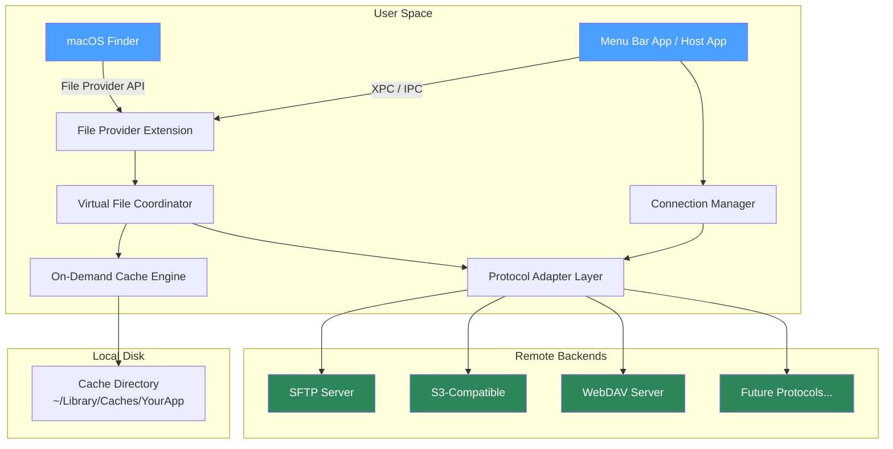
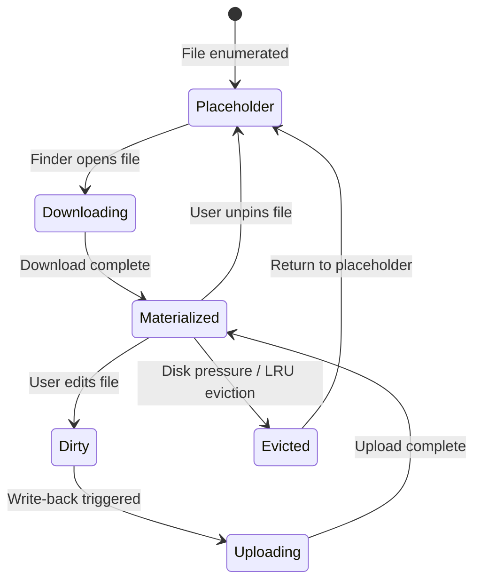

# Open-Source macOS Cloud/Remote Filesystem Mounter

An architectural blueprint for building an open-source alternative to Mountain Duck — a native macOS application that mounts remote storage (SFTP, S3, WebDAV, etc.) as virtual drives accessible through Finder.

---

## 1. Problem Statement

macOS users need seamless, transparent access to remote filesystems (primarily SFTP) through the native Finder experience — browsing, opening, editing, and saving files as if they were local — without requiring a dedicated transfer client or manual sync workflows. Existing solutions are either proprietary/paid (Mountain Duck) or fragile/unmaintained (various FUSE wrappers).

---

## 2. High-Level Architecture



### Component Summary

| Component | Responsibility |
| :--- | :--- |
| **Host App (Menu Bar)** | User-facing GUI for managing connections, viewing transfer status, preferences. The "container" app that ships the File Provider Extension. |
| **File Provider Extension** | macOS extension that implements Apple's `FileProvider` framework. This is the core rune — it makes remote files appear in Finder. |
| **Virtual File Coordinator** | Orchestrates file enumeration, materialization (download-on-open), and eviction (cache cleanup). Bridges between Finder's requests and the protocol layer. |
| **On-Demand Cache Engine** | Manages local file cache: stores hydrated files, tracks dirty state, handles write-back, enforces cache size limits. |
| **Protocol Adapter Layer** | Abstraction over remote protocols. Each adapter (SFTP, S3, WebDAV) implements a common interface for listing, reading, writing, and stat operations. |
| **Connection Manager** | Handles connection lifecycle: credential storage (Keychain), reconnection logic, multiplexing, and health monitoring. |

---

## 3. The Two Paths: File Provider API vs. FUSE

This is the single most consequential architectural decision. Both approaches have been used historically, with very different trade-off profiles.

### Option A: Apple File Provider API (Recommended)

> [!TIP]
> This is the modern, Apple-sanctioned approach. Mountain Duck migrated to this in recent versions. It is the path with long-term viability on macOS.

**How it works:**
- You create a **File Provider Extension** (an app extension target in Xcode).
- You implement Apple's [`FileProvider`](https://developer.apple.com/documentation/fileprovider) framework protocols.
- macOS handles the Finder integration, sync badges, context menus, and conflict resolution UI automatically.
- Files appear under `~/Library/CloudStorage/YourApp/` or as a sidebar entry in Finder.

**Key Protocols to Implement:**

```
NSFileProviderReplicatedExtension (macOS 12+)
├── func item(for identifier:) → NSFileProviderItem
├── func enumerator(for containerItemIdentifier:) → NSFileProviderEnumerator
├── func fetchContents(for itemIdentifier:) → Progress  // "hydration"
├── func createItem(basedOn:) → NSFileProviderItem
├── func modifyItem(_:baseVersion:...) → NSFileProviderItem
├── func deleteItem(identifier:baseVersion:...) → Void
└── func materializedItemsDidChange() → Void  // cache management hook
```

**Advantages:**
- ✅ First-class Finder integration (badges, progress bars, context menus)
- ✅ No kernel extensions required — runs entirely in user space
- ✅ Survives macOS updates without breakage
- ✅ Apple handles conflict UI, offline queueing primitives, and eviction policy
- ✅ Appears natively in Finder sidebar alongside iCloud Drive

**Disadvantages:**
- ⚠️ API is complex and under-documented (Apple's docs are... sparse)
- ⚠️ Requires macOS 12 Monterey+ for the replicated extension model
- ⚠️ Less control over low-level filesystem semantics (e.g., custom xattrs, POSIX permissions)
- ⚠️ Debugging extensions is notoriously painful (must attach debugger to the extension process)

---

### Option B: FUSE (macFUSE / FUSE-T)

**How it works:**
- You use [macFUSE](https://osxfuse.github.io/) or its successor [FUSE-T](https://www.fuse-t.org/) to implement a user-space filesystem.
- Your code receives VFS callbacks (open, read, write, readdir, stat, etc.) and translates them into remote protocol calls.
- The mounted volume appears as a standard macOS disk in Finder and `/Volumes/`.

**Advantages:**
- ✅ Full POSIX filesystem semantics (permissions, symlinks, xattrs, fifos)
- ✅ Conceptually simpler — just implement filesystem callbacks
- ✅ Works with any application, not just Finder (terminal, scripts, `rsync`, etc.)
- ✅ Mature ecosystem: `sshfs` already exists as a reference implementation

**Disadvantages:**
- ❌ **macFUSE requires a kernel extension (kext)** — Apple has been deprecating/blocking kexts since macOS 11. Requires users to lower security settings.
- ❌ **FUSE-T avoids kexts** (uses NFS loopback) but has quirks and limited adoption.
- ❌ No native Finder sync badges, progress indicators, or context menu integration.
- ❌ Fragile across macOS upgrades — kernel API changes can break everything.
- ❌ Performance: every filesystem call crosses a user/kernel boundary.

> [!IMPORTANT]
> **Recommendation:** Use the **File Provider API** as the primary integration path. It is the only approach Apple actively supports and maintains. FUSE can optionally be supported as a secondary mount mode for power users who need full POSIX semantics (e.g., running `git` or `rsync` over the mount).

---

## 4. Detailed Component Design

### 4.1 File Provider Extension

The heart of the application. This is a separate binary (app extension) that macOS loads and manages independently from your host app.

#### Core Responsibilities

1. **Enumeration:** When Finder opens a folder, the extension enumerates its contents by querying the remote server and returning `NSFileProviderItem` objects (filename, size, modification date, item type).

2. **Materialization / Hydration:** When a user opens a file, macOS calls `fetchContents(for:)`. The extension downloads the file to a local temporary location and hands the URL back to the system. macOS then provides the file to the requesting application.

3. **Uploads / Modifications:** When a user saves a file, macOS calls `modifyItem()` or `createItem()`. The extension uploads the changed content to the remote server.

4. **Eviction:** When disk space runs low, macOS may evict (delete local copies of) files that are not pinned. The extension is notified via `materializedItemsDidChange()`.

#### Skeleton Implementation (Swift)

```swift
import FileProvider

class MyFileProviderExtension: NSObject, NSFileProviderReplicatedExtension {

    let domain: NSFileProviderDomain
    let connectionManager: ConnectionManager

    required init(domain: NSFileProviderDomain) {
        self.domain = domain
        self.connectionManager = ConnectionManager.shared
        super.init()
    }

    // --- Enumeration ---
    func enumerator(
        for containerItemIdentifier: NSFileProviderItemIdentifier,
        request: NSFileProviderRequest
    ) throws -> NSFileProviderEnumerator {
        return RemoteDirectoryEnumerator(
            itemIdentifier: containerItemIdentifier,
            connection: connectionManager.activeConnection(for: domain)
        )
    }

    // --- Download / Hydration ---
    func fetchContents(
        for itemIdentifier: NSFileProviderItemIdentifier,
        version requestedVersion: NSFileProviderItemVersion?,
        request: NSFileProviderRequest,
        completionHandler: @escaping (URL?, NSFileProviderItem?, Error?) -> Void
    ) -> Progress {
        let progress = Progress(totalUnitCount: 100)

        Task {
            do {
                let connection = connectionManager.activeConnection(for: domain)
                let remotePath = try resolveRemotePath(for: itemIdentifier)
                let localURL = cacheURL(for: itemIdentifier)

                try await connection.download(
                    remotePath: remotePath,
                    to: localURL,
                    progress: progress
                )

                let item = try makeFileProviderItem(for: itemIdentifier)
                completionHandler(localURL, item, nil)
            } catch {
                completionHandler(nil, nil, error)
            }
        }

        return progress
    }

    // --- Upload / Modify ---
    func modifyItem(
        _ item: NSFileProviderItem,
        baseVersion: NSFileProviderItemVersion,
        changedFields: NSFileProviderItemFields,
        contents newContents: URL?,
        options: NSFileProviderModifyItemOptions,
        request: NSFileProviderRequest,
        completionHandler: @escaping (NSFileProviderItem?, NSFileProviderItemFields, Bool, Error?) -> Void
    ) -> Progress {
        let progress = Progress(totalUnitCount: 100)

        Task {
            do {
                let connection = connectionManager.activeConnection(for: domain)
                let remotePath = try resolveRemotePath(for: item.itemIdentifier)

                if let localURL = newContents {
                    try await connection.upload(
                        from: localURL,
                        to: remotePath,
                        progress: progress
                    )
                }

                let updatedItem = try makeFileProviderItem(for: item.itemIdentifier)
                completionHandler(updatedItem, [], false, nil)
            } catch {
                completionHandler(nil, [], false, error)
            }
        }

        return progress
    }

    // ... deleteItem, createItem, etc.
}
```

---

### 4.2 Protocol Adapter Layer

A pluggable abstraction so the core logic is protocol-agnostic. Each backend implements a common interface.

```swift
/// The universal contract every remote backend must fulfill.
protocol RemoteFilesystemAdapter {
    /// List contents of a remote directory.
    func listDirectory(path: String) async throws -> [RemoteFileEntry]

    /// Download a remote file to a local destination.
    func download(remotePath: String, to localURL: URL, progress: Progress) async throws

    /// Upload a local file to a remote destination.
    func upload(from localURL: URL, to remotePath: String, progress: Progress) async throws

    /// Delete a remote file or directory.
    func delete(remotePath: String) async throws

    /// Create a remote directory.
    func createDirectory(path: String) async throws

    /// Move/rename a remote item.
    func move(from: String, to: String) async throws

    /// Get metadata for a single remote item.
    func stat(path: String) async throws -> RemoteFileEntry

    /// Disconnect and clean up.
    func disconnect() async
}

struct RemoteFileEntry {
    let name: String
    let path: String
    let isDirectory: Bool
    let size: Int64
    let modificationDate: Date
    let permissions: UInt16?      // POSIX permissions (SFTP)
    let owner: String?
}
```

#### SFTP Adapter (Primary Target)

For SFTP, the recommended Swift library is **[NMSSH](https://github.com/NMSSH/NMSSH)** (Obj-C, well-established) or **[Citadel](https://github.com/orlandos-nl/Citadel)** (pure Swift, SwiftNIO-based, modern).

> [!TIP]
> **Citadel** is the stronger choice for a new project — it's pure Swift, built on SwiftNIO for async/await, and avoids linking against libssh2. It handles SSH key exchange, authentication, and SFTP channel management natively.

```swift
import Citadel

class SFTPAdapter: RemoteFilesystemAdapter {
    private var client: SSHClient?
    private var sftp: SFTPClient?

    func connect(host: String, port: Int, credentials: Credentials) async throws {
        self.client = try await SSHClient.connect(
            host: host,
            port: port,
            authenticationMethod: credentials.sshAuthMethod
        )
        self.sftp = try await client?.openSFTP()
    }

    func listDirectory(path: String) async throws -> [RemoteFileEntry] {
        guard let sftp else { throw AdapterError.notConnected }
        let contents = try await sftp.listDirectory(atPath: path)
        return contents.map { entry in
            RemoteFileEntry(
                name: entry.filename,
                path: "\(path)/\(entry.filename)",
                isDirectory: entry.attributes.type == .directory,
                size: Int64(entry.attributes.size ?? 0),
                modificationDate: entry.attributes.modificationDate ?? Date(),
                permissions: entry.attributes.permissions,
                owner: nil
            )
        }
    }

    func download(remotePath: String, to localURL: URL, progress: Progress) async throws {
        guard let sftp else { throw AdapterError.notConnected }
        let data = try await sftp.readFile(at: remotePath)
        try data.write(to: localURL)
        progress.completedUnitCount = progress.totalUnitCount
    }

    // ... upload, delete, move, stat, disconnect
}
```

---

### 4.3 On-Demand Cache Engine

The cache sits between Finder and the remote server. Its job: minimize network round-trips while keeping disk usage bounded.



**Key Cache Policies:**
- **LRU Eviction:** When cache exceeds a configurable size limit (e.g., 5 GB), evict least-recently-used files that are not pinned.
- **Write-Back:** Dirty files are uploaded asynchronously. A journal tracks pending uploads to survive app crashes.
- **Metadata Cache:** Directory listings are cached with a configurable TTL (e.g., 30 seconds) to avoid hammering the server on every Finder navigation.

#### Cache Storage Layout

```
~/Library/Caches/com.yourapp.fileprovider/
├── domains/
│   ├── <domain-uuid-1>/              # One domain per connection
│   │   ├── files/                     # Materialized file content
│   │   │   ├── <item-id-hash-1>
│   │   │   ├── <item-id-hash-2>
│   │   │   └── ...
│   │   ├── metadata.sqlite           # Item metadata + tree structure
│   │   └── journal.sqlite            # Pending upload/delete operations
│   └── <domain-uuid-2>/
│       └── ...
└── config.json                        # Global cache settings
```

---

### 4.4 Connection Manager

Handles credential storage, connection pooling, reconnection, and health checks.

- **Keychain Integration:** Store SSH keys, passwords, and tokens in the macOS Keychain via `Security.framework`. Never persist credentials to disk in plaintext.
- **Connection Pooling:** For SFTP, maintain a pool of SSH channels to parallelize downloads/uploads without opening new TCP connections.
- **Auto-Reconnect:** Monitor connection health with periodic keepalives. On disconnect, queue operations and retry with exponential backoff.
- **XPC Bridge:** The File Provider Extension runs in a separate process from the host app. Communication between them uses XPC (or shared `UserDefaults` / `NSFileProviderManager` signals).

---

### 4.5 Host App (Menu Bar Application)

A lightweight macOS menu bar app that serves as:

1. **Connection Configuration UI:** Add/edit/remove server connections (hostname, port, credentials, mount point name).
2. **Transfer Monitor:** Display active uploads/downloads, speeds, and errors.
3. **Domain Manager:** Register/unregister `NSFileProviderDomain` instances (each domain = one mounted server).
4. **Preferences:** Cache size limits, metadata TTL, log verbosity, startup behavior.

**Technology choice:** SwiftUI for the UI, targeting macOS 13+.

```swift
// Registering a new File Provider domain (= mounting a server)
let domain = NSFileProviderDomain(
    identifier: NSFileProviderDomainIdentifier("my-sftp-server"),
    displayName: "My SFTP Server"
)

try await NSFileProviderManager.add(domain)
// The domain now appears in Finder's sidebar under "Locations"
```

---

## 5. Technology Stack

| Layer | Technology | Rationale |
| :--- | :--- | :--- |
| **Language** | Swift 5.9+ | Native macOS development, async/await, strong typing |
| **UI Framework** | SwiftUI | Modern, declarative, minimal boilerplate for menu bar apps |
| **File Provider** | `FileProvider.framework` (Apple) | The only sanctioned way to integrate with Finder |
| **SFTP** | [Citadel](https://github.com/orlandos-nl/Citadel) (SwiftNIO-based) | Pure Swift, async, no C library dependencies |
| **S3** | [Soto](https://github.com/soto-project/soto) | Comprehensive AWS SDK for Swift |
| **WebDAV** | Custom implementation over `URLSession` | WebDAV is HTTP — no heavy library needed |
| **Credential Storage** | macOS Keychain (`Security.framework`) | System-level secure storage |
| **Local Metadata DB** | SQLite via [GRDB.swift](https://github.com/groue/GRDB.swift) | Lightweight, embedded, battle-tested |
| **Networking Foundation** | [SwiftNIO](https://github.com/apple/swift-nio) | High-performance async I/O (used by Citadel) |
| **Build System** | Xcode / Swift Package Manager | Standard Apple toolchain |

---

## 6. Project Structure

```
OpenDuck/
├── OpenDuck.xcodeproj
├── Package.swift                           # SPM dependencies
│
├── App/                                    # Host menu bar application
│   ├── AppDelegate.swift
│   ├── MenuBarController.swift
│   ├── Views/
│   │   ├── ConnectionListView.swift
│   │   ├── AddConnectionView.swift
│   │   ├── TransferMonitorView.swift
│   │   └── PreferencesView.swift
│   ├── Models/
│   │   ├── ServerConnection.swift
│   │   └── AppSettings.swift
│   └── Resources/
│       ├── Assets.xcassets
│       └── Info.plist
│
├── FileProviderExtension/                  # File Provider Extension target
│   ├── FileProviderExtension.swift         # NSFileProviderReplicatedExtension
│   ├── FileProviderEnumerator.swift        # Directory enumeration
│   ├── FileProviderItem.swift              # NSFileProviderItem implementation
│   ├── DomainService.swift                 # Domain lifecycle management
│   └── Info.plist                          # Extension configuration
│
├── Core/                                   # Shared framework / SPM package
│   ├── Protocols/
│   │   └── RemoteFilesystemAdapter.swift   # Protocol abstraction
│   ├── Adapters/
│   │   ├── SFTPAdapter.swift
│   │   ├── S3Adapter.swift
│   │   └── WebDAVAdapter.swift
│   ├── Cache/
│   │   ├── CacheEngine.swift
│   │   ├── CachePolicy.swift
│   │   └── UploadJournal.swift
│   ├── Connection/
│   │   ├── ConnectionManager.swift
│   │   ├── CredentialStore.swift
│   │   └── ConnectionHealthMonitor.swift
│   └── Utilities/
│       ├── PathResolver.swift
│       └── Logger.swift
│
├── Tests/
│   ├── CoreTests/
│   │   ├── SFTPAdapterTests.swift
│   │   ├── CacheEngineTests.swift
│   │   └── ConnectionManagerTests.swift
│   └── IntegrationTests/
│       └── FileProviderIntegrationTests.swift
│
├── LICENSE                                 # e.g., GPL-3.0 or MIT
└── README.md
```

---

## 7. Implementation Roadmap

### Phase 1: Foundation (Weeks 1–4)

> Get a single SFTP server to appear in Finder. Bare minimum, read-only.

- [ ] Set up Xcode project with Host App + File Provider Extension targets
- [ ] Implement `SFTPAdapter` with Citadel: connect, list, download, stat
- [ ] Implement `NSFileProviderReplicatedExtension` with basic enumeration
- [ ] Implement `fetchContents` (file hydration / download-on-open)
- [ ] Hardcode a single SFTP connection for testing
- [ ] Verify: browse remote directories in Finder, open remote files in Preview/TextEdit

### Phase 2: Write Support & Cache (Weeks 5–8)

> Make it read-write. Add caching so it doesn't re-download everything.

- [ ] Implement `createItem`, `modifyItem`, `deleteItem` in the extension
- [ ] Build the on-demand cache engine with LRU eviction
- [ ] Implement the upload journal for crash-resilient write-back
- [ ] Add metadata caching (directory listing TTL)
- [ ] Handle rename/move operations
- [ ] Verify: create, edit, save, delete files via Finder

### Phase 3: Host App UI (Weeks 9–12)

> Give users a way to manage connections without editing code.

- [ ] Build SwiftUI menu bar app shell
- [ ] Connection management UI (add/edit/remove SFTP servers)
- [ ] Keychain integration for credential storage
- [ ] SSH key import (`.pem`, OpenSSH format)
- [ ] Domain registration/deregistration (mount/unmount)
- [ ] Transfer progress monitoring in menu bar dropdown
- [ ] Preferences: cache size, metadata TTL

### Phase 4: Robustness & UX Polish (Weeks 13–16)

> Make it reliable for daily use.

- [ ] Auto-reconnect with exponential backoff
- [ ] Conflict detection and resolution (concurrent remote changes)
- [ ] Offline mode: queue writes, sync on reconnect
- [ ] Pin/unpin files for offline availability
- [ ] Finder badge integration (synced, syncing, error states)
- [ ] Error notification system (connection failures, permission errors)
- [ ] Comprehensive logging and diagnostics

### Phase 5: Additional Protocols & Distribution (Weeks 17+)

> Expand beyond SFTP.

- [ ] S3 adapter (via Soto)
- [ ] WebDAV adapter
- [ ] Homebrew Cask distribution
- [ ] GitHub Releases with notarized `.dmg`
- [ ] Documentation site
- [ ] Optional: FUSE-T secondary mount mode for POSIX-heavy workflows

---

## 8. Key Challenges & Mitigations

| Challenge | Details | Mitigation |
| :--- | :--- | :--- |
| **File Provider API complexity** | Apple's documentation is notoriously incomplete. Edge cases around item versioning, conflict handling, and domain lifecycle are poorly documented. | Study open-source references: [FileProviderSample](https://developer.apple.com/documentation/fileprovider), [swift-file-provider](https://github.com/nicklama/swift-file-provider). Join Apple Developer Forums. Budget extra time for this layer. |
| **Extension ↔ Host App IPC** | The File Provider Extension runs in its own sandboxed process. Sharing state (active connections, credentials) requires careful IPC design. | Use App Groups for shared `UserDefaults` and Keychain access. Use `NSFileProviderManager.signalEnumerator()` for change notifications. Consider XPC for complex communication. |
| **SFTP performance** | SFTP is inherently latency-bound (single TCP connection, sequential requests). Large directory listings or bulk transfers can feel sluggish. | Prefetch directory metadata. Use connection pooling (multiple SFTP channels over one SSH connection). Implement read-ahead for sequential file access. |
| **Sandbox restrictions** | App extensions are heavily sandboxed. Network access must be explicitly entitled. File access is restricted to the extension's container. | Ensure proper entitlements (`com.apple.security.network.client`). Use App Groups for shared containers. |
| **macOS version fragmentation** | `NSFileProviderReplicatedExtension` requires macOS 12+. Older APIs (`NSFileProviderExtension`) are deprecated but needed for macOS 11 support. | Target macOS 13+ (Ventura) as the minimum. This covers ~95%+ of active Macs and provides the most stable File Provider API surface. |

---

## 9. Relevant Open-Source References

| Project | What to learn from it |
| :--- | :--- |
| [**Cyberduck**](https://github.com/iterate-ch/cyberduck) (Java) | Protocol adapters, connection management, credential handling. The spiritual ancestor. |
| [**sshfs**](https://github.com/libfuse/sshfs) (C, FUSE) | SFTP-over-FUSE implementation. Study caching strategies and SFTP edge cases. |
| [**Citadel**](https://github.com/orlandos-nl/Citadel) (Swift) | The SFTP library you'll likely use. Study its API surface and async patterns. |
| [**rclone**](https://github.com/rclone/rclone) (Go) | Multi-protocol adapter design. Excellent reference for S3, WebDAV, and SFTP abstraction. Also has its own mount command (FUSE-based). |
| [**FileProvider samples**](https://developer.apple.com/documentation/fileprovider) (Apple) | Apple's own sample code for File Provider extensions. Start here. |
| [**GRDB.swift**](https://github.com/groue/GRDB.swift) (Swift) | SQLite wrapper for metadata and journal storage. |
| [**Strongbox**](https://github.com/strongbox-password-safe/Strongbox) (Swift) | A macOS/iOS app that implements File Provider for password database access. Good real-world reference for the extension lifecycle. |

---

## 10. Licensing Considerations

| License | Pros | Cons |
| :--- | :--- | :--- |
| **MIT** | Maximum adoption, permissive, simple | No copyleft — forks can go proprietary |
| **GPL-3.0** | Copyleft ensures derivatives remain open | May discourage corporate contributors; App Store distribution complications |
| **MPL-2.0** | File-level copyleft — balanced middle ground | Less well-known; some ambiguity around Swift modules |
| **Apache-2.0** | Permissive + explicit patent grant | No copyleft |

> [!NOTE]
> If your goal is maximum community adoption while keeping the core open, **MPL-2.0** or **Apache-2.0** are pragmatic choices. If you want to ensure all derivatives remain open-source, **GPL-3.0** is the stronger shield — but note that Citadel is MIT-licensed, so there are no license conflicts there.

---

## 11. Summary

The core mechanism is straightforward in concept but demanding in execution:

1. **Apple's File Provider framework** is your gateway into Finder. It replaces the need for kernel extensions or FUSE hacks.
2. **A protocol adapter layer** keeps the core logic decoupled from any specific remote backend — start with SFTP, expand later.
3. **An on-demand cache** with LRU eviction and a write-back journal makes remote files feel local without consuming unbounded disk.
4. **A menu bar host app** provides the user-facing control plane for connection management.

The hardest part is not the networking or the UI — it's getting the File Provider Extension to behave correctly across all of Finder's expectations (enumeration, versioning, conflicts, eviction). Budget the majority of your early effort there.
